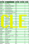
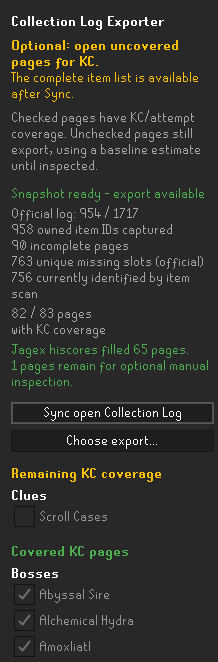
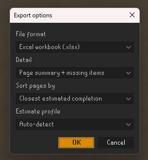
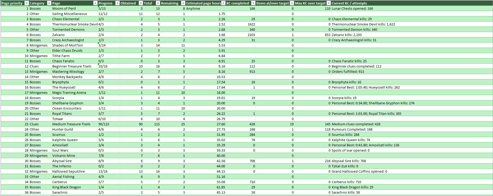
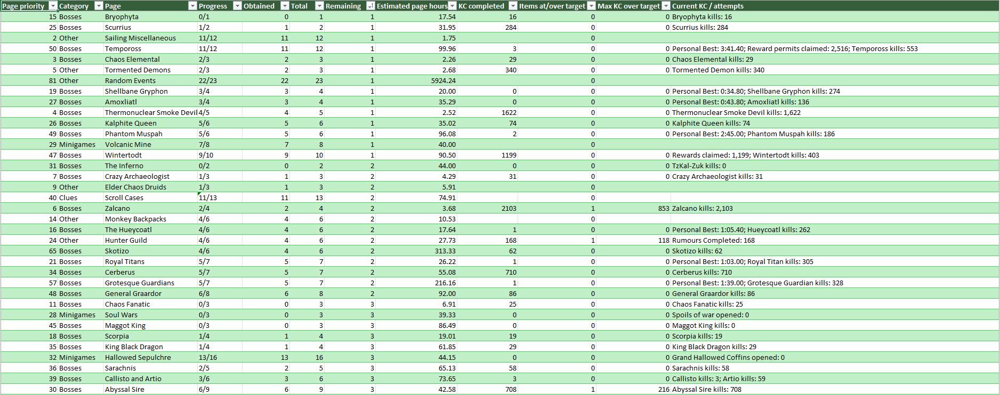
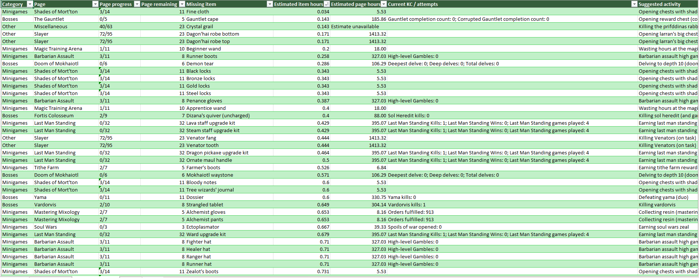

# Collection Log Exporter

Turn your missing Collection Log slots into a sortable spreadsheet. Compare unfinished pages, review missing items and plan your next goal in Excel, LibreOffice or Google Sheets.

## Export the view you need

| Format | Use it for |
| --- | --- |
| **XLSX** | Excel workbooks with sortable tables and filter buttons. |
| **ODS** | Workbooks for LibreOffice and OpenOffice. |
| **CSV** | A single portable table, including import into Google Sheets. |

Workbooks include **Page summary**, **Remaining items** and **About** sheets. Choose the detail level and sort order before saving. CSV supports one table: summary-only exports page summaries; the other detail choices export missing-item rows with page fields repeated.

## Find your next goal

- See page progress, remaining slots, completed KC and a closest-page ranking.
- Compare loose effective-time estimates using **Estimate rates**: automatic account detection, main or iron rates.
- Review each missing slot with its suggested activity, bundled drop rate and supporting calculation fields.
- Unknown estimates say **Estimate unavailable**. Items at or beyond nominal rate show **Anytime** and how far over target their KC is.

### Page summary

Sort the summary by closest estimated completion to bring practical short-term goals to the top.

  
See the page summary sorted by remaining slots

  

### Remaining items

The detailed view puts each missing item beside its page progress, estimate, current counters and suggested activity.

These are planning estimates, not predictions of when a random drop will arrive. Being over rate does not make the next kill more likely to drop the item.

## Sync, then save

1. Open your own Collection Log. If needed, press **Sync open Collection Log** in the plugin panel.
2. Click the log's native **Search** button once and wait for **Snapshot ready**.
3. Supported counters fill from public Jagex hiscores. Optionally open unchecked pages to improve KC coverage; this does not block export.
4. Select **Choose export...**, pick format, detail, sorting and estimate profile, then choose a destination file.

For Google Sheets, import the saved CSV or XLSX using **File → Import → Upload**.

## Keep your data local

The plugin saves files where you choose and uploads no Collection Log data. Its network lookup sends the logged-in character name to official Jagex hiscores for public counters. Shared items are deduplicated in global missing totals, while each page retains its own slot progress.

Rate-data credits are in [Third-party notices](THIRD_PARTY_NOTICES.md).

## Installation

Open RuneLite's **Configuration → Plugin Hub**, search for **Collection Log Exporter** and install it. Open the plugin's settings to customise the options above.

[View on the Plugin Hub](https://runelite.net/plugin-hub/show/collection-log-exporter).

## Development

See [development and implementation reference](DEVELOPMENT_REFERENCE.md) for the preserved setup instructions, technical details, testing notes and existing project documentation.

## Support

Enjoy the plugin? [Visit the GSVS UK ACM Patreon shop](https://www.patreon.com/cw/GSVS_UK_ACM/shop) to support the work.
